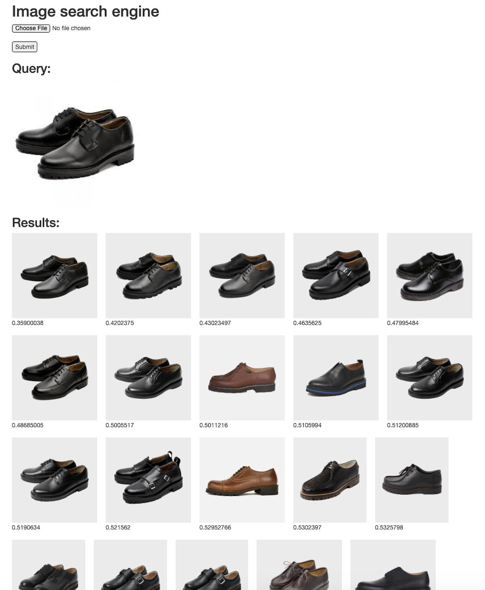

# Image searcher
## 사용법
### package 설치
```sh
python3 -m venv venv
source ./venv/bin/activate
pip3 install -r requirements.txt
```
### 이미지 크롤링
```sh
# 학습시키고싶은 이미지 URL을 item_image_urs.csv에 입력
# 현재 url은 남성신발 이미지만 존재

python3 item_downloader.py
```
### 다운받은 이미지 특성추출 (이미지->숫자배열화)
```sh
python3 img_to_feature.py
```
### 이미지 검색 서버 실행
```sh
python3 server.py
```
### Demo
